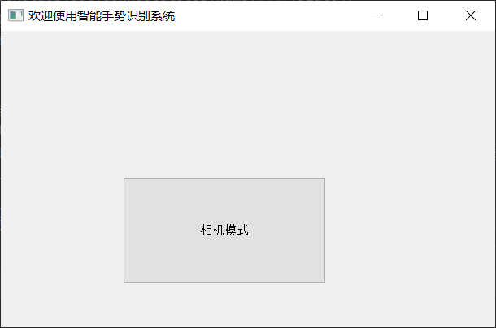

# 基于mediapipe的特效相机

#### 介绍
  &emsp;&emsp;本项目通过mediapipe与k-means算法通过对人手21个关键点的采样分析，实现
  了可以流畅识别自定义手势的智能手势识别系统。

#### 安装教程

  &emsp;&emsp;直接在命令指示符下进入本项目目录输入`pip install -r requirements.txt`，即可完成环境的配置

#### 使用说明
  &emsp;&emsp;使用`python main.py` 或者在ide中进入本项目文件夹下运行`main.py`
1. 主界面

  &emsp;&emsp;当运行`main.py`后会出现，点击相机模式即可进行下一步操作

2. 照相模式

&emsp;&emsp; 在此页面下用户可通过访问自定义手势设置来设置自定义手势相关数据或是访问开始摄像来体验本项目

3. 设置

&emsp;&emsp;用户可在此处通过点击图像的方式来实现对对应手势的更改，或是观察已有手势

